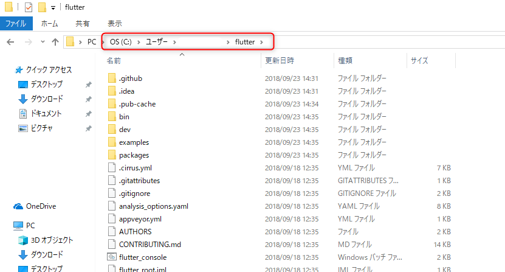
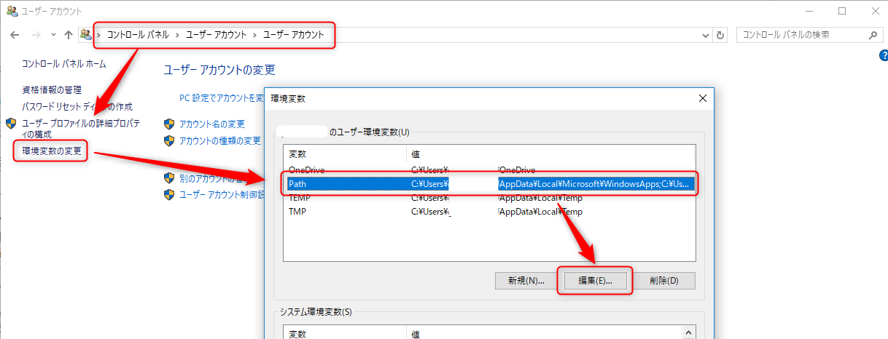
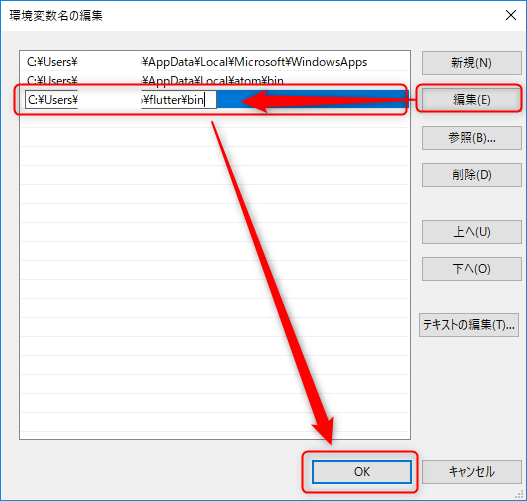
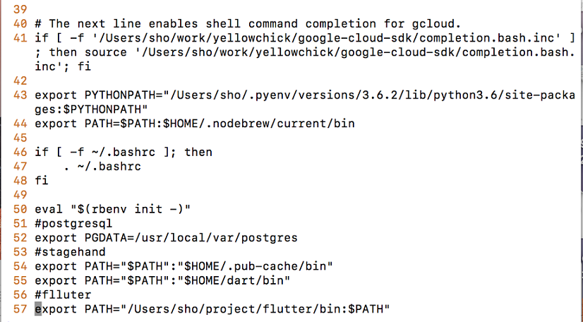

# 開発環境を構築しよう

<div class="draft-author">

</div>

それでは、開発するために環境構築を行います。

インストールするものは次のとおりです。

 * Flutter SDK
 * Android Studio
 * Xcode（（Macのみ）iOSの開発を行う場合）

基本的に開発環境および開発はWindows 10をベースに行います。
Flutterはベータ版なのでインストール方法が変わる可能性があります。

執筆現在（2018/9/23）のインストール方法について紹介します。
本書の手順でうまくいかない場合など最新のインストール方法については公式サイトをご覧ください。

公式サイト： [https://flutter.io/get-started/install/](https://flutter.io/get-started/install/)

## Flutter SDKのインストール

Flutter SDKのインストールを行います。
WindowsとMacのインストールがそれぞれ異なるので順に説明します。

### Windows版

1. 公式のFlutterのサイト（[https://flutter.io/setup-windows/](https://flutter.io/setup-windows/)）にアクセスします。
Flutter SDKのダウンロードリンクをクリックし、ダウンロードします。

※執筆時点ではフォルダー名が「flutter_macos_v0.8.2-beta.zip」となっております。


2. ダウンロードしたZipファイルを展開し中身のFlutterフォルダを「C:\Users\ユーザフォルダ」の下などに配置します。



3.「コントロールパネル > ユーザーアカウント > ユーザーアカウント > 環境変数の変更」をすると次のような画面が表示されます。

「Path」と書かれた行を選択した上で編集というボタンを押します。



4. 先ほど 2.の手順で配置したフォルダのパスを「編集」をクリックし、設定します。

本書と同じ手順であれば「C:\Users\ユーザフォルダ\flutter\bin」となります。
設定が完了したらOKをクリックし、閉じます。



Windows版のFlutter SDKの準備は完了です。

### Mac版

1. 公式のFlutterのサイト（@<href>{https://flutter.io/setup-macos/}）にアクセスします。
Flutter SDKのダウンロードリンクをクリックし、ダウンロードします。

※執筆時点ではフォルダー名が「flutter_macos_v0.8.2-beta.zip」となっております。


2. 公式ドキュメントどおり、ホーム直下に「development」フォルダーを作成し、そこにダウンロードしたzipファイルを展開しましょう。

```shell script
  $ cd
  $ mkdir development
  $ cd ~/development
  $ unzip ~/Downloads/flutter_macos_v0.8.2-beta.zip
```

3. パスを追加します。次のコマンドを入力して、「~.bash_profile」ファイルにパスを書き込みます。

```shell script
  $ cd
  $ vim .bash_profile
```

```shell script
  #ファイルの一番下に書き込む userと書かれた部分には実行ユーザ名が入ります。
  export PATH=/Users/${user}/development/flutter/bin:$PATH
```

※次の画像の57行目のように入力して下さい。画像では、「user」の箇所が実行ユーザ名の「sho」となっています。
ここの名前は実行環境により異なります。




4. pathを定義したファイルの再読み込みを行ないます。

```shell script
source $HOME/.bash_profile
```


5. pathが更新されたかを確認します。

```shell script
echo $PATH
```

※場合によっては、次の画像のように先頭に表示されない場合がありますので、注意して確認してください。


Mac 版の Flutter SDK の準備は完了です。

次の章ではいったんアプリの開発を始める前にサンプルプログラムを動かして、デバイスへのデプロイなどを体験しましょう。
